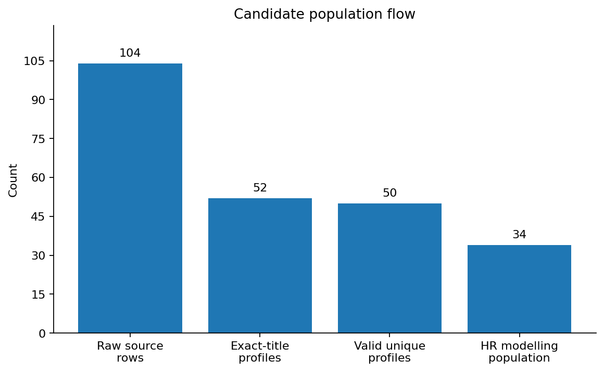

# Potential Talents

## 1. Executive Summary

Talent sourcing requires substantial manual effort to identify relevant candidates, rank the strongest profiles, and incorporate management judgement as role requirements evolve. The major objective is to develop and validate a scalable candidate-screening and ranking pipeline that reduces manual review, prioritises candidates by fitness, and uses management feedback to refine rankings when justified.

The first objective is to establish a valid candidate population. The supplied dataset contains 104 records with `id`, `job_title`, `location`, `connection`, and `fit`. After duplicate and invalid profiles are removed, transparent occupational rules identify 34 HR-relevant roles with unique job titles.

The second objective is to construct a defensible ground truth because the supplied `fit` field contains no observed values. Rule-based screening produces occupational relevance `H` on a 0–1 scale, while NLPL Model 40 Word2Vec embeddings produce semantic relevance `W` from similarity to the HR search queries “Aspiring human resources” and “Seeking human resources,” supported by focused EDA. These complementary signals are weighted equally as `G = (H + W) / 2`.

The third objective is to develop an automated ranking model. Candidate titles are represented with the aforementioned pretrained Word2Vec embeddings and ranked using a PCA–Ridge pipeline.

The fourth objective is to test whether the ranking generalises. Repeated nested cross-validation is used, with NDCG as the primary ranking metric and complementary regression and rank-agreement measures.

The fifth objective is to test whether management feedback improves ranking. Feedback is introduced at 10%, 20%, and 50% review depths, separating fitted changes from held-out performance. Additional top-25 analyses test sensitivity.

The sixth objective is to turn evidence into a scalable operating recommendation. Management feedback changes fitted rankings but does not appreciably improve held-out NDCG at any tested review depth, with changes −0.002256, −0.005188, −0.002668.

Recommended approach: retain frozen pre-feedback automated ranking, continue collecting management feedback, only promote feedback-driven retraining when future held-out evidence shows genuine improvement. Screening removes unsuitable candidates, automated ranking prioritises review effort, human judgement remains part of decision process.

## 2. Business Context

The main business challenge begins after candidate profiles have been sourced: recruiters must determine which candidates genuinely fit a specific role and which should be prioritised for review. This project focuses specifically on identifying and ranking candidates for Human Resources roles based on their job titles. The aim is to reduce manual screening by filtering unsuitable profiles, ranking suitable candidates by fitness, and allowing the ranking to adapt when management identifies a candidate who better reflects the desired HR profile.

The project must therefore determine how to screen irrelevant candidates, rank the remaining candidates, incorporate management feedback, assess whether useful screening criteria can transfer to other roles, and reduce repetitive human judgement without removing necessary oversight. A successful solution should reduce review effort, remain interpretable, respond appropriately to feedback, and scale to larger candidate pools and changing role requirements.

## 3. Methodology

### 3.1 Candidate Population & Screening

The analysis begins with all 104 supplied records. The dataset contains five fields:

- `id` — unique record identifier, retained for candidate traceability;
- `job_title` — the candidate’s role/profile text and the main source of occupational information;
- `location` — geographic location;
- `connection` — number of professional connections;
- `fit` — intended 0–1 candidate-fitness target, but unpopulated in the supplied data.

Because this use case evaluates occupational relevance to Human Resources, `job_title` is used for screening and later semantic modelling, while `id` is retained to trace each analytical record back to the source data. Repeated records with the same job title are collapsed to one representative profile using the lowest candidate ID, reducing 104 source rows to 52 distinct title profiles.

Two of these 52 profiles are removed following human inspection because they do not describe genuine candidate roles. ID 75 — “Nortia Staffing is seeking Human Resources, Payroll & Administrative Professionals!! (408) 709-2621” — is a staffing/recruitment advertisement rather than a candidate profile. ID 103 — “Always set them up for Success” — is a non-occupational slogan with no candidate role information. Removing these records leaves 50 valid profiles with unique job titles.

The 50 valid profiles are then screened using explicit occupational rules:

- **Direct HR, H = 1:** titles containing clear HR evidence such as “Human Resources,” standalone acronym “HR,” “CHRO,” or HR credentials such as “GPHR” or “SPHR”.
- **Adjacent HR, H = 0.5:** titles containing closely related people functions such as “People Development,” “People Operations,” “Talent Management,” “Talent Acquisition,” or “Talent Development”.
- **Irrelevant, H = 0:** titles matching none of the direct or adjacent HR indicators.

The screening logic was developed and checked through human inspection of representative HR, borderline, and unrelated job titles to ensure rules reflected intended occupational distinction. Once fixed, same rules applied automatically to every profile, with direct HR rules taking precedence over adjacent rules and unmatched titles classified irrelevant. This removes 16 irrelevant profiles and retains 34 HR-relevant roles for modelling: 33 direct HR profiles and one adjacent profile. The 50 → 34 reduction therefore combines human judgement in defining/validating screening criteria with consistent automated application across dataset.

### 3.2 Analytical Target Construction

Since the supplied fit field contains no observed values, the project cannot train against an existing ground truth and thus a defensible analytical target must be constructed as the ground truth. The occupational relevance score `H` established in Section 3.1 is therefore combined with a second signal, semantic relevance `W`, which measures how closely each candidate’s job title matches the intended HR search profile.

Focused exploratory analysis of the job-title vocabulary and recurring HR terminology was used alongside the role requirements to determine and lock two representative search queries:

- **“Aspiring human resources”**
- **“Seeking human resources”**

Semantic relevance `W` is calculated using pretrained NLPL Model 40 Word2Vec embeddings. Each candidate title and each search query is represented as a 100-dimensional semantic vector. Cosine similarity is calculated between every candidate and both queries, rescaled to the 0–1 range, and averaged to produce a single `W` score. Using two queries reduces dependence on one exact wording of the desired HR profile.

The final analytical ground truth is then defined as `G = (H + W) / 2`, giving equal weight to occupational relevance and semantic similarity. This allows the target to incorporate both explicit evidence that a role belongs to the HR domain and finer semantic differences between otherwise relevant candidate titles.

The semantic signal also supports the earlier screening decision. Retained HR candidates have a mean `W` of approximately 0.904 compared with 0.798 for excluded profiles, showing that the retained group is generally more aligned with the HR search language.

### 3.3 Ranking Model Development

Only the candidate’s job-title information is used as a predictive model input. The `location` and `connection` fields are excluded because the defined task is to estimate occupational fitness from the information contained in the candidate’s role description. Including them would introduce signals outside the stated role-matching definition. The unpopulated `fit` field cannot be used, while `id` is retained only for traceability and deterministic tie-breaking. The constructed ground truth `G` from Section 3.2 is therefore the model target.

Each of the 34 retained `job_title` values is converted into a 100-dimensional vector using the pretrained NLPL Model 40 Word2Vec representation described previously. This produces a modelling matrix of 34 candidates × 100 embedding features. Because the number of embedding dimensions is large relative to the number of candidates, modelling all 100 dimensions directly would create unnecessary instability and redundancy. Principal Component Analysis (PCA) is therefore fitted inside the modelling pipeline and retains the minimum number of components required to explain 95% of variance in training embeddings. PCA is fitted only on relevant training data whenever model trained, preventing evaluation-data influence.

Principal components standardized using `StandardScaler` before Ridge regression. Ridge selected as simple interpretable regularised linear model suited to small dataset with many correlated embedding-derived features. L2 regularisation shrinks unstable coefficients. Locked pipeline: **PCA → StandardScaler → Ridge regression**, predicts continuous `G`.

Ridge hyperparameter `alpha`: 15 candidate values logarithmically 0.001 to 100. For each model fit, alpha selected using shuffled 4-fold inner CV, MSE tuning objective. Lowest mean validation MSE chosen; numerical ties prefer larger alpha for stronger regularization.

Locked default configuration:

- Random seed 42
- PCA variance retained 95%
- PCA solver full SVD
- Ridge alpha grid 15 log-spaced 0.001–100
- Inner hyperparameter tuning shuffled 4-fold CV
- Tuning objective MSE
- Tie-break equivalent alpha: larger alpha

Model quality assessed primarily using NDCG because business objective is strongest candidates near top. NDCG @4,@7,@10,@17,@34. MAE/RMSE measure prediction error vs G; Spearman/Kendall measure ordering agreement. Metrics distinguish score prediction from ranking.

After alpha selected, complete pipeline produces continuous predicted fitness score. Candidates ordered highest-lowest; id only exact-tie resolution.

### 3.4 Baseline & Out-of-Sample Evaluation

Generalisation is evaluated using repeated nested cross-validation so model tuning and model assessment remain separate. 34-candidate cohort divided into 5 outer folds, full process repeated 10 times, producing 50 independent outer train/test evaluations. Within each outer training set, Ridge alpha selected using 4-fold inner procedure from 3.3; resulting pipeline fitted on outer training set and evaluated only on held-out candidates. Each candidate receives one genuinely OOS prediction every repeat, producing 340 OOS predictions across 10 repetitions. Metrics calculated from held-out predictions rather than fitted training scores.

A deterministic **W-only baseline** is evaluated alongside learned PCA–Ridge using same 34 candidates and same NDCG cutoffs. Baseline ranks candidates directly by semantic relevance W, providing simple reference. Comparing both under same framework shows whether additional modeling pipeline produces ranking behavior beyond direct semantic similarity alone.

### 3.5 Management Feedback & Re-ranking

Management feedback is introduced only after initial automated ranking. Three review depths: approx **10% (top 4)**, **20% (top 7)**, **50% (top 17)**. Reviewed sets frozen from original pre-feedback ranking so feedback cannot change who enters review group. Management provides one strict preferred ordering of top17, smaller experiments same judgement restricted to corresponding top4/top7.

Feedback changes order without creating new fitness values. Existing analytical target scores reassigned within reviewed set so management-preferred candidates receive higher scores already present. Example if B preferred above A but A has higher target, target values exchanged. Overall set/distribution of G unchanged; management gives relative preference, not numerical fitness scores.

Preferences applied sequentially highest requested position downward. Each requested position one management action. If preferred candidate already in required position: no-op, no target change. Otherwise relevant scores swapped and effective action. Earlier established positions preserve required relative order.

After each effective action, model updated immediately. Ridge alpha retuned using same 4-fold inner CV, full PCA-Ridge refitted against revised target, new ranking generated. Step-by-step trajectory shows effect per intervention.

Design keeps reviewed population fixed, preserves original target-score values, records effective/no-op separately, retrains after genuine changes. Allows management effort and fitted ranking movement measured directly; Section 3.6 tests whether changes improve held-out ranking.

### 3.6 Feedback Validation & Model Selection

Feedback-adjusted models use same repeated nested CV as original. Separate evaluations 10/top4, 20/top7, 50/top17. Revised target passes same 5 outer folds × 10 repeats; alpha retuned with 4-fold inner CV. Held-out NDCG at matching review depth compared to pre-feedback. Selection based on genuine repeated OOS improvement, not fitted following of management order.

Separate fitted improvement vs generalisation improvement. Full-data closer fit insufficient. Primary criterion repeated held-out NDCG change. Top25 sensitivity on HR34 and broader valid50 as robustness checks only; do not determine production model.

Fixed decision rule: adopt feedback retraining only if improves repeated held-out NDCG vs frozen pre-feedback. If fitted rankings change but no held-out improvement, original automated model retained. Requires evidence of generalisation.

## 4. Results & Key Findings

The analysis reduced original 104 supplied records to 34 HR-relevant candidates through duplicate removal, invalid-record exclusion, occupational screening, as detailed 3.1/3.2. **Figure 1** summarises progression `104 → 52 → 50 → 34`, showing final modelling cohort. Remaining results focus ranking and management feedback.

**Figure 1 — Candidate population flow**

Pre-feedback PCA–Ridge mean OOS NDCG: `0.9897 @4`, `0.9910 @7`, `0.9921 @10`, `0.9947 @17`, `0.9974 @34`. **Figure 2** compares analytical ground-truth rank vs mean OOF Ridge rank; concentration around diagonal shows broad agreement when held out.

**Figure 2 — Analytical ground-truth rank vs mean out-of-sample Ridge rank**

W-only baseline NDCG: 1.0000 @4,@7,@10,@17 and 0.9999 @34; slightly higher PCA-Ridge at every cutoff. Learned model still near-perfect. Relationship baseline/constructed target deferred to Section 6.

Feedback: 10% .989739→.987483 delta -.002256; 20% .991032→.985843 delta -.005188; 50% .994684→.992015 delta -.002668. **Figure 3** all negative. Feedback altered ranking but changes did not generalize better.

**Figure 3 — Effect of management feedback on held-out ranking performance**

Effective actions 3,1,8; fitted NDCG changes -0.000496,+0.000535,+0.000252. **Figure 4** intervention vs fitted changes. 50% greatest intervention only tiny fitted gain and still reduced held-out NDCG.

**Figure 4 — Management effort versus fitted ranking gain**

Top25: HR34 automated .998753 → management .995400 delta -.003353; valid50 .998708 → .995400 delta -.003308. Consistent across main and sensitivity.

Overall, automated pre-feedback ranking strong OOS; tested feedback changes ranking without improved generalisation. Evidence supports retaining automated ranking current production basis, treating management feedback as information collected/validated rather than automatically incorporated.

## 5. Business Recommendation

Retain the frozen pre-feedback automated ranking as the current production basis. PCA–Ridge shows strong out-of-sample ranking performance, while none of the tested management-feedback depths improves held-out NDCG. Management feedback should remain part of the review process, but it should not automatically trigger retraining or replacement of the current ranking model.

Management feedback should instead be collected in a structured form and periodically evaluated against held-out performance before being incorporated into production. This preserves human oversight without allowing individual preferences to alter the ranking unless they demonstrate evidence of generalisation. Recruiters can review the highest-ranked candidates, record meaningful disagreements with the automated order, and accumulate this evidence for future retraining tests.

Operationally, the screening rules should remove clearly irrelevant profiles, the automated ranking should prioritise recruiter attention, and human review should focus on the highest-ranked or disputed candidates. For new roles or larger candidate pools, the same framework can be reused with role-specific search terms and validated screening criteria, but the current HR rules and thresholds should not be assumed to transfer unchanged. Final hiring judgement should remain human.

## 6. Limitations & Future Work

The main limitation is that candidate fitness is not observed directly in the supplied data. The analytical ground truth `G` is constructed from occupational relevance `H` and semantic relevance `W`, so model performance measures how well the ranking reproduces this defensible proxy rather than confirmed hiring success, recruiter outcomes, or later employee performance. This also means the very strong `W`-only baseline must be interpreted carefully: `W` is itself one half of `G`, while 33 of the 34 retained candidates share the same `H = 1` value, making semantic similarity a dominant source of variation within the final HR cohort.

The analysis is also limited to one role family and a relatively small final cohort of 34 HR-relevant candidates. The screening rules, search queries, and resulting ranking behaviour are therefore specific to this HR use case and should not be assumed to transfer directly to other occupations. In particular, the project does not establish a universal similarity cutoff for candidate eligibility; future roles should define and validate their own occupational rules, search language, and screening behaviour using role-specific evidence.

Management feedback is also limited by the amount and type of preference information available in this experiment. The analysis tests one strict management ordering at several review depths, so the findings show that this particular feedback did not improve held-out ranking performance; they do not establish that management feedback can never add value. Future work should collect preference data across more reviewers, roles, and hiring cycles, then test whether repeated feedback produces stable signals that improve out-of-sample ranking before those signals are incorporated into production retraining.

The strongest next step would be to replace or supplement the constructed proxy target with observed business outcomes where these become available. Examples include recruiter assessment, interview progression, shortlist acceptance, hiring decisions, or later performance indicators. These labels would allow future models to be evaluated against real recruitment outcomes rather than only against the current analytical ground truth, while larger and more diverse datasets would make it possible to test more flexible modelling approaches without sacrificing validation reliability.

## 7. Repository Structure

The repository separates the main analysis, reusable source code, data, external-model metadata, configuration, and reproducibility files so that the project can be inspected without relying on notebook cells alone. The main components are:

- `00_Project_Audit_and_Setup.ipynb` — initial project, data, environment, and dependency checks;
- `01_Potential_Talents_Main.ipynb` — authoritative end-to-end analysis containing data preparation, EDA, target construction, modelling, validation, feedback experiments, figures, and final findings;
- `src/` — reusable Python modules for data processing, HR screening rules, Word2Vec embeddings, modelling, ranking, feedback, validation, and figure generation;
- `data/` — supplied raw candidate data and project data assets;
- `models/` — metadata and supporting files required to validate and use the external NLPL Model 40 Word2Vec resource;
- `project_control/` — run configuration, manifests, and project-level audit information;
- `requirements.txt` and `requirements-lock.txt` — project dependencies and the locked execution environment.

The notebook remains the primary reviewer-facing analytical record, while repeated logic is kept in `src/` so that important calculations are implemented once and called consistently throughout the project.

The project is designed to be reproducible from a clean environment. Dependencies are pinned, random seeds and model settings are centralized, the raw dataset and external embedding resource are validated before use, and the main notebook calls the same reusable source functions used throughout the pipeline. Key outputs, figures, rankings, validation summaries, and run metadata are regenerated from the executed workflow rather than maintained as disconnected manual artifacts. This keeps the notebook, source code, and reported results aligned and allows the full analysis to be rerun and audited from the repository contents.

The final project deliverables are the executed main notebook, the supporting `src/` modules, the validated data and model-resource metadata required to reproduce the analysis, the generated ranking and validation outputs, the final README, and the figures used to communicate the main findings. Together, these files provide the complete analytical record, implementation, supporting evidence, and reviewer-facing documentation for the project.
